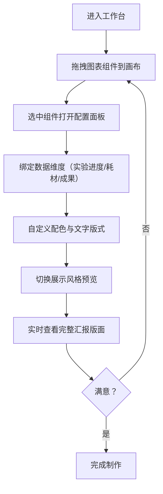

## 1. 产品概述

科研汇报页面可视化制作工具，面向科研人员提供拖拽式图表配置与汇报版面设计能力。支持自由组合折线、柱状、雷达、对比等图表组件，绑定实验进度、耗材消耗、成果产出等多维度数据，提供专业配色方案与版式自定义，实现极简学术/正式汇报双风格切换，实时预览完整汇报版面。

- 目标用户：科研工作者、实验室研究员、学术汇报人员
- 核心价值：快速制作专业级科研汇报可视化页面，零代码拖拽操作，纯线上实时预览

## 2. 核心功能

### 2.1 用户角色
| 角色 | 注册方式 | 核心权限 |
|------|----------|----------|
| 科研人员 | 无需注册，直接使用 | 拖拽图表、配置数据、切换风格、预览版面 |

### 2.2 功能模块
1. **组件面板**：提供折线图、柱状图、雷达图、对比图表四类可拖拽组件
2. **画布区域**：支持自由拖拽摆放、调整大小、删除组件
3. **数据绑定面板**：配置实验进度、耗材消耗、成果产出等数据维度
4. **样式配置面板**：配色方案选择、文字版式自定义
5. **风格切换器**：极简学术 / 正式汇报两种展示风格一键切换
6. **实时预览区**：完整汇报版面实时渲染预览

### 2.3 页面详情
| 页面名称 | 模块名称 | 功能描述 |
|----------|----------|----------|
| 主工作台 | 左侧组件面板 | 展示四类图表组件，支持拖拽到画布 |
| 主工作台 | 中间画布区域 | 自由布局，拖拽调整组件位置与大小 |
| 主工作台 | 右侧配置面板 | 数据维度绑定、配色方案、文字样式配置 |
| 主工作台 | 顶部工具栏 | 风格切换、预览模式切换、清空画布 |
| 预览模式 | 全屏预览区 | 展示完整汇报版面，支持两种风格切换查看 |

## 3. 核心流程

用户进入工作台 → 从左侧拖拽图表组件到画布 → 选中组件在右侧配置面板绑定数据维度 → 调整配色与文字版式 → 切换极简学术/正式汇报风格查看效果 → 实时预览完整汇报版面 → 继续调整直至满意

## 4. 用户界面设计

### 4.1 设计风格

#### 极简学术风格
- 主色调：象牙白(#FAFAF7) + 深灰(#2C3E50) + 墨蓝(#1E3A5F)
- 字体：思源宋体 + Inter 无衬线体
- 布局：大量留白，极简边框，学术期刊风格
- 装饰：细线条分隔，编号标注，克制的装饰元素

#### 正式汇报风格
- 主色调：藏青(#0F2749) + 金色(#C9A962) + 纯白(#FFFFFF)
- 字体：思源黑体 + 优雅的衬线标题字体
- 布局：卡片式容器，精致阴影，层次分明
- 装饰：渐变背景，金色点缀，专业商务感

### 4.2 页面设计概述
| 页面名称 | 模块名称 | UI 元素 |
|----------|----------|----------|
| 主工作台 | 组件面板 | 卡片式组件预览，拖拽时半透明效果，悬停高亮 |
| 主工作台 | 画布区域 | 网格背景辅助对齐，选中组件显示调整手柄，虚线边框 |
| 主工作台 | 配置面板 | 分组折叠式配置项，颜色选择器，下拉选择，滑块调节 |
| 主工作台 | 顶部工具栏 | 标签页式风格切换，图标按钮，状态指示灯 |
| 预览模式 | 全屏预览 | 渐入动画，分页展示，平滑过渡效果 |

### 4.3 响应性
- 桌面端优先设计，适配 1920×1080 及以上分辨率
- 三栏布局（左20% + 中55% + 右25%），支持拖拽调整面板宽度
- 预览模式自适应全屏，保持汇报版面比例

### 4.4 交互细节
- 组件拖拽：幽灵预览 + 放置指示线
- 画布缩放：Ctrl+滚轮缩放画布，适应不同组件密度
- 配置变更：实时响应，配置后立即在画布上看到效果
- 风格切换：平滑过渡动画，300ms 淡入淡出切换

