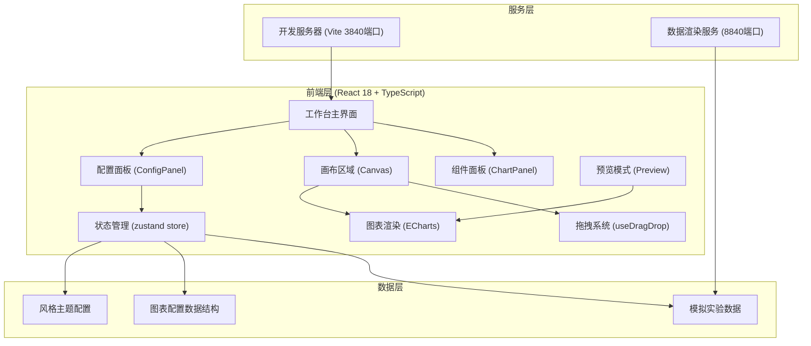

## 1. 架构设计



## 2. 技术描述

- 前端框架：React 18 + TypeScript 5
- 构建工具：Vite 5
- 样式方案：TailwindCSS 3
- 状态管理：Zustand
- 图表库：ECharts 5
- 拖拽实现：原生 HTML5 Drag and Drop API + 自定义 useDragDrop Hook
- 图标库：lucide-react
- 后端：无（纯前端应用，Mock 数据）
- 数据：内置模拟科研数据，无需数据库

## 3. 路由定义

| 路由 | 页面组件 | 用途 |
|------|----------|------|
| / | Workbench | 主工作台，三栏布局拖拽配置界面 |
| /preview | Preview | 全屏预览完整汇报版面 |

## 4. 核心数据模型

### 4.1 图表组件数据结构

```typescript
interface ChartComponent {
  id: string;
  type: 'line' | 'bar' | 'radar' | 'compare';
  title: string;
  position: { x: number; y: number };
  size: { width: number; height: number };
  dataConfig: DataConfig;
  styleConfig: StyleConfig;
}

interface DataConfig {
  dimension: 'experiment_progress' | 'consumable_cost' | 'output_achievement';
  timeRange: 'week' | 'month' | 'quarter' | 'year';
  dataPoints: DataPoint[];
}

interface DataPoint {
  label: string;
  value: number;
  category?: string;
}

interface StyleConfig {
  colors: string[];
  fontSize: number;
  fontFamily: string;
  showLegend: boolean;
  showGrid: boolean;
  borderRadius: number;
}
```

### 4.2 风格主题配置

```typescript
interface ThemeConfig {
  mode: 'minimal_academic' | 'formal_report';
  colors: {
    primary: string;
    secondary: string;
    background: string;
    surface: string;
    text: string;
    accent: string;
    chartPalette: string[];
  };
  typography: {
    headingFont: string;
    bodyFont: string;
    baseFontSize: number;
  };
  layout: {
    spacing: number;
    borderRadius: number;
    shadowLevel: 'none' | 'low' | 'medium' | 'high';
  };
}
```

## 5. 目录结构

```
src/
├── components/
│   ├── charts/          # 图表组件（LineChart, BarChart, RadarChart, CompareChart）
│   ├── layout/          # 布局组件（Panel, Canvas, Toolbar）
│   └── config/          # 配置组件（DataConfig, StyleConfig, ThemeSwitcher）
├── hooks/
│   ├── useDragDrop.ts   # 拖拽逻辑 Hook
│   └── useChartData.ts  # 图表数据处理 Hook
├── store/
│   └── useReportStore.ts # Zustand 状态管理
├── types/
│   └── index.ts         # 类型定义
├── data/
│   └── mockData.ts      # 模拟科研数据
├── config/
│   └── themes.ts        # 主题配色配置
├── pages/
│   ├── Workbench.tsx    # 工作台页面
│   └── Preview.tsx      # 预览页面
├── utils/
│   └── chartUtils.ts    # 图表工具函数
├── App.tsx
└── main.tsx
```

## 6. 状态管理设计

```typescript
// useReportStore
interface ReportState {
  components: ChartComponent[];
  selectedComponentId: string | null;
  currentTheme: 'minimal_academic' | 'formal_report';
  isPreviewMode: boolean;
  
  // Actions
  addComponent: (type: ChartType, position: Position) => void;
  removeComponent: (id: string) => void;
  updateComponent: (id: string, updates: Partial<ChartComponent>) => void;
  selectComponent: (id: string | null) => void;
  switchTheme: (theme: ThemeMode) => void;
  togglePreview: () => void;
  clearCanvas: () => void;
}
```
